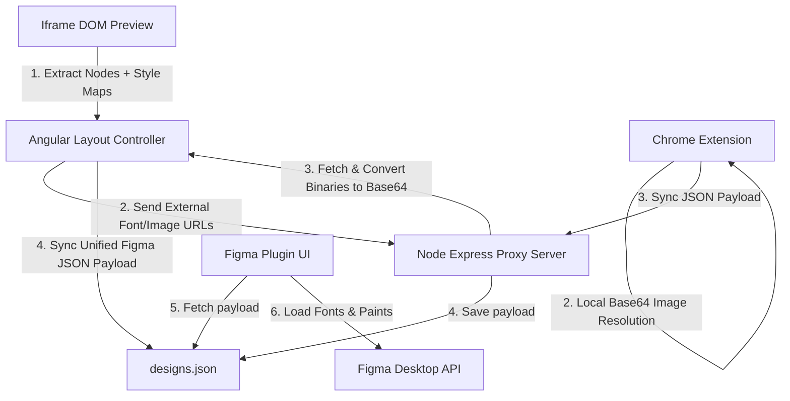

# Architecture Overview

This document describes the technical architecture and data flow of the Figify HTML-to-Figma Converter.

---

## Technical Architecture Diagram

---

## Component Responsibilities

### 1. Extraction Layer (Web Client)
* **File:** [app.ts](file:///Users/jgu7man/Code/jguzman/figify-app/src/app/app.ts)
* **Responsibilities:**
  * Traverses the DOM trees inside the preview iframe recursively.
  * Measures element coordinates using bounding client rectangles.
  * Parses advanced styles like border highlights, input placeholders, shadows, and linear gradients (converting angles into a Figma-compatible 2x3 matrix).
  * Measures pseudo-elements (`::before` / `::after`) by inserting temporary mirror spans in the DOM flow.
  * Evaluates flexbox rules (`display: flex`, `gap`, `padding`) and sizing properties (`auto`, `content-width`) to output Auto Layout coordinates.

### 2. Node Express Server (Backend)
* **File:** [server.ts](file:///Users/jgu7man/Code/jguzman/figify-app/src/server.ts)
* **Responsibilities:**
  * Hosts the Angular application and serves client-side static resources.
  * Exposes REST endpoints to save, retrieve, and delete compiled design payloads.
  * Bypasses client-side CORS policies by acting as a proxy for remote visual images, converting them into Base64 strings.
  * Resolves all relative asset URLs to absolute paths using requesting headers.

### 3. Drawing Engine (Figma Plugin)
* **Files:**
  * [code.ts](file:///Users/jgu7man/Code/jguzman/figify-app/figma-plugin/src/code.ts) (Plugin Controller)
  * [ui.html](file:///Users/jgu7man/Code/jguzman/figify-app/figma-plugin/src/ui.html) (Plugin UI)
* **Responsibilities:**
  * Interfaces with the backend API to retrieve synced designs list.
  * Performs parallel preloading of all unique font styles present in the design payload to optimize rendering speeds.
  * Recreates text layers, vector outlines (from SVGs), and frame layers in the active Figma viewport.
  * Applies solid fills, Base64 image paints, gradient stops, custom rounded corners, and shadow effects.
  * Sets up responsive Auto Layout containers (Vertical / Horizontal alignment, paddings, item spacing, grow, align-self) and applies absolute position overrides where needed.
