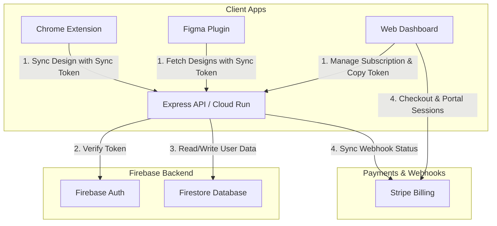

# Billing Infrastructure & Multi-User Architecture

This document describes the proposed design for transitioning Figify from a local, single-user tool to a paid SaaS application. The architecture incorporates **Firebase Authentication** for user identity, **Cloud Firestore** for data isolation, and **Stripe** for subscription and payment management.

---

## Architecture Diagram

The diagram below illustrates the interactions between the client applications, the backend API, database storage, and Stripe's billing system:

---

## Component Details

### 1. User Authentication (Firebase Auth)
*   **Purpose:** Allows users to create accounts and log in securely.
*   **Implementation:** 
    *   **Frontend:** The Angular app integrates the client-side Firebase Auth SDK (Google and Email/Password sign-in).
    *   **Backend:** The Express server uses the Firebase Admin SDK to verify client-side JWTs when they access protected web-only dashboard endpoints.

### 2. Database Layer (Cloud Firestore)
*   **Purpose:** Replaces the local `designs.json` file to store user-specific configuration and design history.
*   **Structure:**
    *   `/users/{uid}/settings`: Contains user settings, sync tokens, and billing references.
    *   `/users/{uid}/designs/{designId}`: Stores individual design JSON payloads.
*   **Security Rules:** Firestore rules enforce that users can only read and write data under their own `{uid}` path.

### 3. Sync Token Authentication
*   **Purpose:** Authorizes actions performed inside external clients (Chrome Extension and Figma Plugin) without exposing the user's password or main session cookie.
*   **Flow:**
    *   Every user gets a cryptographically secure, unique **Sync Token** generated and stored in `/users/{uid}/settings` on signup.
    *   The user copies this token from their web dashboard.
    *   The Chrome Extension and Figma Plugin save this token locally and attach it as an `Authorization: Bearer <SyncToken>` header on every API request.
    *   The backend verifies the token and maps it back to the corresponding `uid`.

### 4. Billing Platform (Stripe)
*   **Subscription Product:** A recurring subscription (e.g. $9.99/month) created in the Stripe Dashboard.
*   **Checkout Flow:**
    1.  The user clicks "Upgrade to Premium" in the Angular app.
    2.  The Angular app requests a checkout session from the backend (`/api/billing/create-checkout-session`).
    3.  The backend calls Stripe's API to create a Checkout Session and returns the checkout URL.
    4.  The user is redirected to Stripe to pay, and then redirected back to the app.
*   **Customer Portal:** Allows users to update payment methods or cancel their subscription. The backend generates portal sessions via `/api/billing/create-portal-session`.
*   **Webhooks:**
    *   The backend exposes an unauthenticated endpoint at `/api/billing/webhook`.
    *   Stripe calls this webhook for events:
        *   `checkout.session.completed` -> set user subscription to `active`.
        *   `customer.subscription.deleted` -> set user subscription to `inactive`.
        *   `customer.subscription.updated` -> synchronize plan changes.

---

## API Endpoints Overview

| Method | Endpoint | Authentication | Description |
| :--- | :--- | :--- | :--- |
| **GET** | `/api/figma/designs` | `Bearer <SyncToken>` | Retrieves list of designs belonging to the token's owner. |
| **POST** | `/api/figma/designs` | `Bearer <SyncToken>` | Saves a new design to the owner's Firestore collection. (Checks if subscription is active). |
| **DELETE** | `/api/figma/designs/:id` | `Bearer <SyncToken>` | Deletes a specific design from the owner's Firestore collection. |
| **POST** | `/api/billing/create-checkout-session` | Session / JWT | Initiates Stripe Checkout for the logged-in user. |
| **POST** | `/api/billing/create-portal-session` | Session / JWT | Generates link to Stripe Customer Portal. |
| **POST** | `/api/billing/webhook` | Stripe Signature | Processes subscription updates sent by Stripe. |
